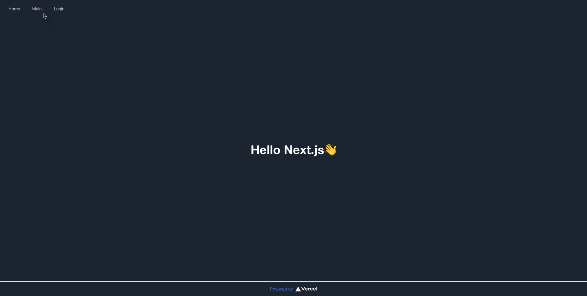

# tutorial-nextjs-blog-todos

Next.js と Firebase(Cloud Firestore, Authentication) を使用した、タスク Web アプリケーション。

[Demo](https://tutorial-nextjs-blog-todos.vercel.app/)。



## 機能

- Firebase Authentication によるユーザログイン
  - ログイン
  - ログアウト
  - サインイン
- ログインリダイレクト
- Firebase Firestore によるリアルタイムタスク管理
  - 追加
  - 編集
  - 削除

## for developer

### develop

```zsh
# pre
git https://github.com/kuro-kuroite/tutorial-nextjs-blog-todos.git
cd tutorial-nextjs-blog-todos/
yarn install

mv .env.local.example .env.local
vim .env.local

# develop
npm run dev # open http://localhost:3000

# build and start
npm run build && npm run start # open http://localhost:3000
```

### deploy

```zsh
# pre
# git add .
# git commit

# deploy
git push origin main # vercel can detect pushing main and deploy it
```

## GraphQL

### fetch schema

```zsh
npx get-graphql-schema https://json-placeholder-graphql.herokuapp.com/graphql > types/api/jsonPlaceHolder.graphql
```

### generate schema

```zsh
# pre
# yarn add @apollo/client graphql
# yarn add -D @graphql-codegen/cli
# npx graphql-codegen init
# yarn install

npm run update:codegen
```
